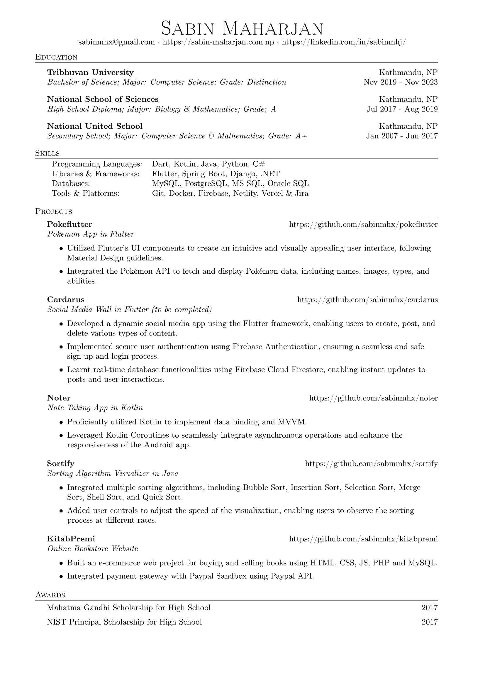

# Resume

This resume template is designed for people in tech industry and it utilizes the base LaTeX templates and fonts, making it easy to install and update. The template includes well-documented sections, ensuring easy customization.

## Preview

## Usage
- Latex Editor
    - Offline
        - [Texmaker](https://www.xm1math.net/texmaker/index.html)
        - [Texstudio](https://www.texstudio.org/)
    - Online
        - [Overleaf](https://www.overleaf.com/)
        - [Papeeria](https://www.papeeria.com)
- Visual Studio Extension
    - [Latex Workshop](https://marketplace.visualstudio.com/items?itemName=James-Yu.latex-workshop)
 
## License
MIT Licensed. See [LICENSE](LICENSE) for full details.
